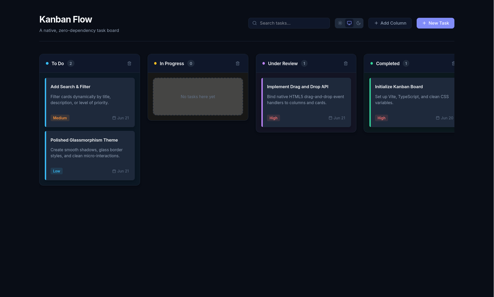

# Kanban Flow — Native, Zero-Dependency Task Board

A highly polished, premium Kanban board built using only native browser web APIs and client-side TypeScript. **Zero external runtime frameworks or UI libraries** (no React, no Tailwind, no Lodash, no drag-and-drop wrappers) — just pure, performant modern front-end engineering.



---

## Key Features

- **Native HTML5 Drag & Drop**: Smooth dragging with custom ghost styling, column highlights, and dynamic drop indicators to preview card placements before releasing.
- **Dynamic Columns**: Create, rename, or delete columns dynamically to custom-tailor your workflow.
- **Comprehensive Task Editing**: Add new tasks or double-click existing ones to modify details, edit description, assign priority, or delete them.
- **Universal Search & Filter**: Real-time searching that scans titles and descriptions to display matches instantly.
- **Glassmorphism & Aesthetics**: Modern UI featuring subtle border gradients, backdrop blur effects, system-responsive dark/light modes, and hover animations.
- **Persistence**: Automated synchronization using `localStorage` ensures tasks, column configurations, and themes persist across sessions.

---

## Tech Stack & Environment

- **Runtime & Package Manager**: [Bun](https://bun.sh/)
- **Bundler & Dev Server**: [Vite](https://vite.dev/)
- **Core Languages**: TypeScript & Vanilla CSS

---

## Project Architecture & Code Artifacts

The workspace maintains a clean, separation-of-concerns-focused directory structure:

```text
├── .agents/              # Project-scoped guidelines and agent configurations
├── dist/                 # Production-ready static assets (generated by bundler)
├── src/
│   ├── components/       # Independent modular UI renderers
│   │   ├── Card.ts       # Individual Task Card styling & drag-start events
│   │   ├── Column.ts     # Column container & drop-detection calculations
│   │   ├── Dialogs.ts    # Native HTML5 dialog forms for Adding/Editing items
│   │   ├── Header.ts     # Top toolbar (Search bar, theme controls, action buttons)
│   │   └── Icons.ts      # Inline SVG helper mapping to standard Lucide icons
│   ├── main.ts           # App Bootstrapper & Custom Event Hub
│   ├── store.ts          # Central state store & LocalStorage engine
│   ├── style.css         # Styling system (Design tokens, glassmorphism, layouts)
│   └── types.ts          # Core TypeScript Interfaces (Task, Column, BoardState)
├── index.html            # Core entry point layout
├── package.json          # Development metadata & run scripts
└── tsconfig.json         # TypeScript compiler configurations
```

---

## Core Design & Architectural Decisions

### 1. Zero-Dependency State Management
Rather than drawing in complex state-management utilities, the application implements a centralized **Store pattern** in [`src/store.ts`](file:///home/xshubhamg/code/projects/frontend/kanban-native/src/store.ts). 
- A single `KanbanStore` class manages `BoardState` consisting of separate `columns` and `tasks` arrays.
- Mutative operations (like `addTask`, `moveTask`, `deleteColumn`) update the state in memory and automatically synchronize changes into the client's `localStorage`.
- The store filters tasks on-the-fly (`getFilteredTasks()`), keeping the application UI clean by separating the full data model from the currently active search results.

### 2. Event-Driven UI Loop
To decouple state updates from user-interface rendering, the application leverages an **event-driven architecture** (implemented in [`src/main.ts`](file:///home/xshubhamg/code/projects/frontend/kanban-native/src/main.ts)):
1. Components publish descriptive custom DOM events (e.g. `kanban-create-task`, `kanban-move-task`, `kanban-theme-change`) which bubble up to the main application container.
2. The orchestrator inside `KanbanApp` captures these events, invokes the corresponding logic inside the `KanbanStore`, and requests a localized or global re-render of the board (`renderBoard()`).
3. This pattern prevents coupling UI rendering code directly to the state class, matching clean MVC principles.

### 3. Native Dialogs for Better Accessibility
Instead of overlaying absolute-positioned absolute-height divs that disrupt standard keyboard focus traps, the project uses the native HTML5 [`<dialog>`](https://developer.mozilla.org/en-US/docs/Web/HTML/Element/dialog) tag (`Dialogs.ts`). Calling the native `.showModal()` API gives you:
- Auto-focus management (the modal keeps tab-key navigation confined inside the form).
- Built-in backdrop customization (`::backdrop`).
- Built-in keyboard interaction support (pressing `Escape` closes the modal automatically).

### 4. Advanced Native Drag-and-Drop Positioning
To implement realistic fluid positioning without third-party libraries, we leverage the native drag-and-drop events:
- Each card has `draggable="true"` and records its ID to the drag event's payload (`e.dataTransfer.setData('text/plain', taskId)`) on `dragstart`.
- While hovering over a column container, we dynamically calculate the **insertion point** relative to surrounding task cards.
- The `getDragAfterElement()` helper compares the client's current vertical coordinate (`clientY`) against the center points of all other cards inside that specific column:

```typescript
private static getDragAfterElement(container: HTMLElement, y: number): HTMLElement | null {
  const draggableElements = Array.from(container.querySelectorAll('.task-card:not(.dragging)'));

  return draggableElements.reduce<{ offset: number; element: HTMLElement | null }>((closest, child) => {
    const box = child.getBoundingClientRect();
    const offset = y - box.top - box.height / 2; // Midpoint distance calculation
    
    if (offset < 0 && offset > closest.offset) {
      return { offset: offset, element: child as HTMLElement };
    } else {
      return closest;
    }
  }, { offset: Number.NEGATIVE_INFINITY, element: null }).element;
}
```
- Depending on the computed target element, the card is visually placed before it or appended to the bottom, providing real-time visual feedback before dropping.

### 5. Unified styling & System Theming
Styles in [`src/style.css`](file:///home/xshubhamg/code/projects/frontend/kanban-native/src/style.css) are designed using CSS variables mapping to a consistent design system.
- **Color Palettes**: Uses HSL-based palettes and muted colors for badges and priority levels (Rose, Cyan, Amber, Violet).
- **Theming**: Implements light and dark styles via class overrides (`.theme-dark` and `.theme-light`). When set to `'system'`, manual classes are omitted, allowing a CSS media query (`@media (prefers-color-scheme: dark)`) to sync with the OS dark/light mode seamlessly.
- **Premium Touches**: Utilizes subtle shadows, high-quality transitions, and backdrop blurs to achieve modern glassmorphism aesthetic for header controls and floating dialogs.

---

## Development & Build Commands

Make sure you have [Bun](https://bun.sh/) installed on your machine.

### 1. Install Dependencies
```bash
bun install
```

### 2. Run Local Development Server
Starts the Vite dev server with fast hot module replacement:
```bash
bun run dev
```

### 3. Build for Production
Compiles TypeScript assets and builds optimized production files to the `dist/` directory:
```bash
bun run build
```

### 4. Preview Production Build Locally
```bash
bun run preview
```
